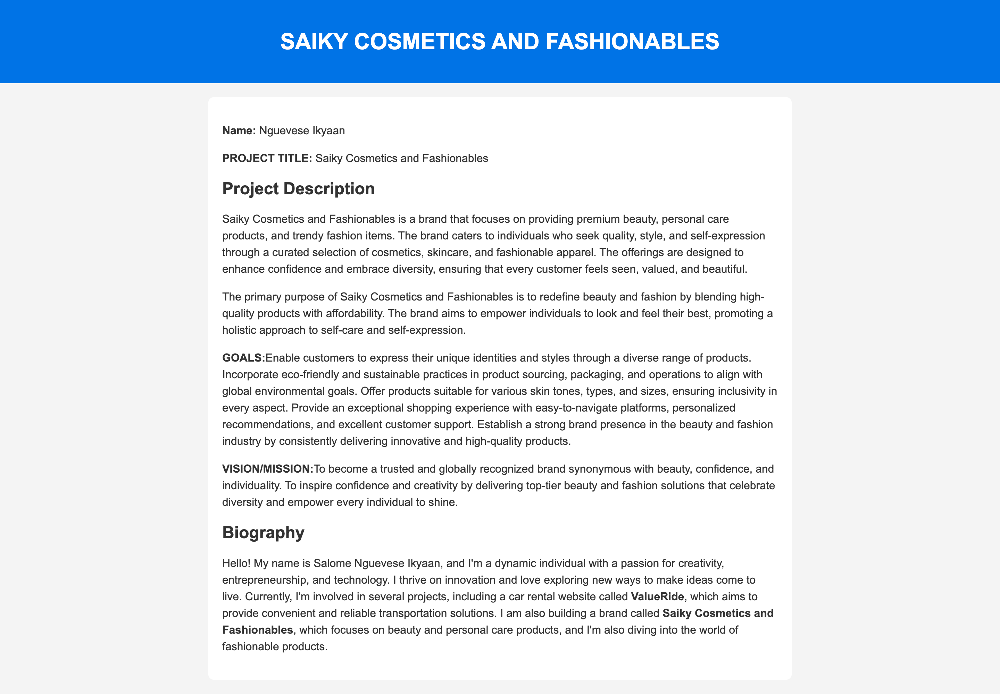

### altschool-2nd-semester-project
# Saiky Cosmetics and Fashionables

### Public IP Address
- http://16.171.141.125

### Screenshots


## 

## Documentation: Provision an EC2 Ubuntu Server with Nginx to Serve HTML file

### **Step 1: Log in to AWS**
- Go to the [AWS Management Console](https://aws.amazon.com/console/) and log in.
- Navigate to the EC2 dashboard.

---

### **Step 2: Launch an Instance**
- Choose an Ubuntu AMI (e.g., `Ubuntu Server 22.04 LTS`).
- Select an instance type (e.g., `t2.micro`).
- Configure a key pair for SSH access.
- Set up security groups to allow:
  - **SSH** (port 22) for remote access.
  - **HTTP** (port 80) for Nginx.

---

### **Step 3: Connect to the Instance**
- Use SSH to connect:
  ```bash
  ssh -i "my-key.pem" ubuntu@16.171.141.125


---

### **Step 4: Install Nginx**
- install nginx:
  ```bash
  sudo apt install nginx
- check nginx status:
  ```bash
  sudo systemctl status nginx


---

### **Step 5: HTML Deployment**
- Created and cloned a github repository on system.
-  Created index.html, README.md, add content and screenshot
- Pushed code to Github
-  SSH into server as shown in step 3. 
- cloned the Github repository at /var/wwww/html
- Edit nginx site-available config to point index to my project

  ```bash
  index altschool-2nd-semester-project/index.html

---